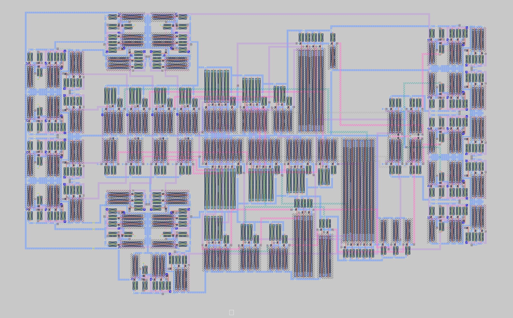

# Synchronous 4-bit CLA Adder Simulation



This is a Synchronous 4-bit Carry Lookahead Adder implemented in NGSPICE, MAGIC, Verilog and FPGA for the VLSI Design (EC6.201) Course I took in Monsoon 2024 at IIIT Hyderabad. The design is based on the [Carry Lookahead Adder](https://en.wikipedia.org/wiki/Carry-lookahead_adder) concept.

## Testing the NGSPICE Simulation

To test the NGSPICE simulation, clone, then run the following commands (provided obviously that you have NGSPICE):

```bash
cd test
chmod +x run_sim.sh
./run_sim.sh
```